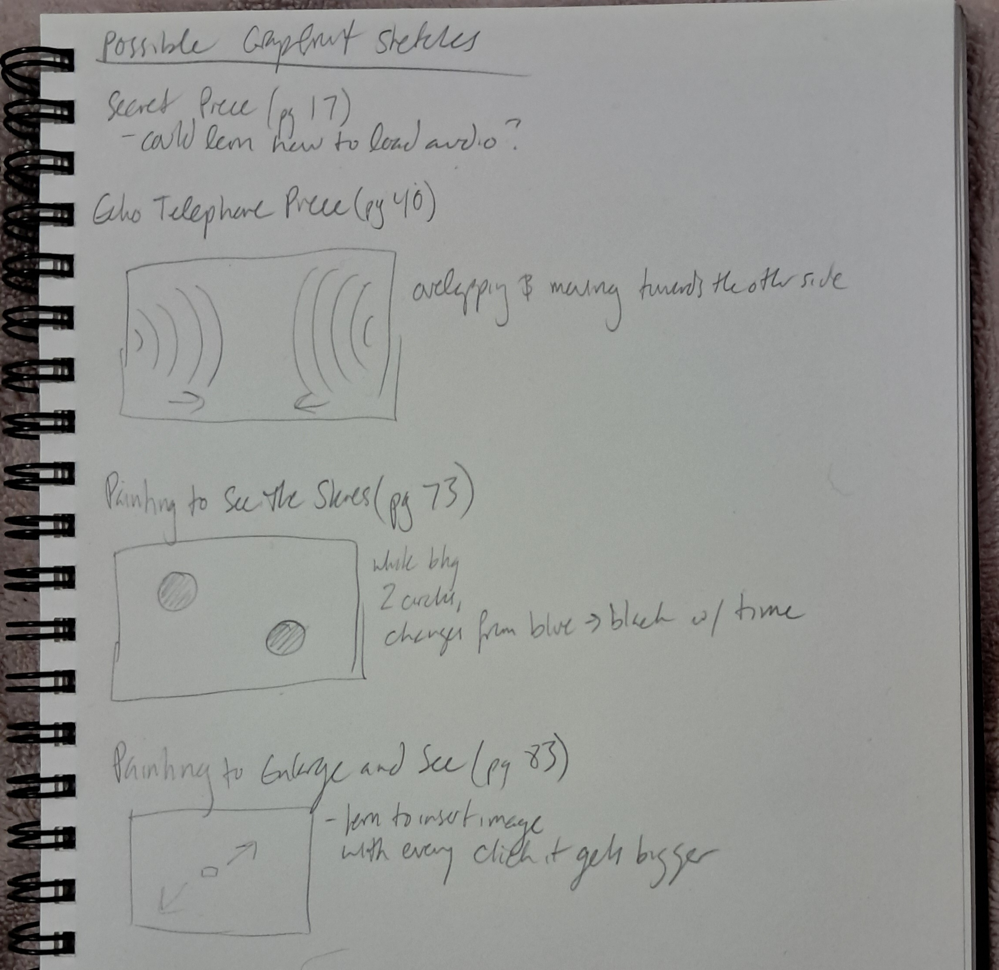

### Sketch A

My original idea for sketch A was to make an hour/minutes/seconds counter that displayed how long it had been since the mouse was clicked. However I ran into some problems with this.

First, I used `millis()` to calculate the seconds, and had to do some troubleshooting to figure out how to only display the full number, without anything after the decimal point. Using `round()` didn't really work, because obviously as soon as a minute or a second hit the 0.5 mark, it would display as 1, meaning that when 30 seconds were up it displayed 1 minute as having passed. Then I tried `.toFixed`, which also didn't work since that still rounds the number. Ultimately, `Math.trunc()` solved this problem.

While I got my hour:minute:second counter to display properly, I was unable to figure out how to make it so that every time the mouse is clicked, it resets the counter. I'm fairly sure the root of this problem is the fact that `millis()` loads before `setup()`, so using `setup()` to reset the page does not actually reset the `millis()` counter. I experimented with a lot of different things, but nothing seemed to fix this problem.

I tried then to figure out if there was a function that would reload/refresh the page, and eventually figured this out with `window.location.reload()` to just forcibly refresh the entire page. I'm a bit disappointed that since it took me so long to try and solve this problem, I wasn't really able to add anything more fun to the page, but I feel satisfied that I solved it and (after a lot of more convoluted attempts) managed to figure out how to display the time counter in a simple way.

### Sketch B

For my Grapefruit drawing, I did "Painting to Enlarge and See," inserting an image of a painting that would grow bigger with every click. It did take me a second to remember how to implement this, settling on making the height and width global state variables.

Then, I set it up so that once the painting fills the screen, the page resets, which I managed to do with an `if()` function in `mouseClicked()` that runs `setup()` when the height or width are no longer less than the page height or width, and had the painting height & width = 1 in `setup()`.